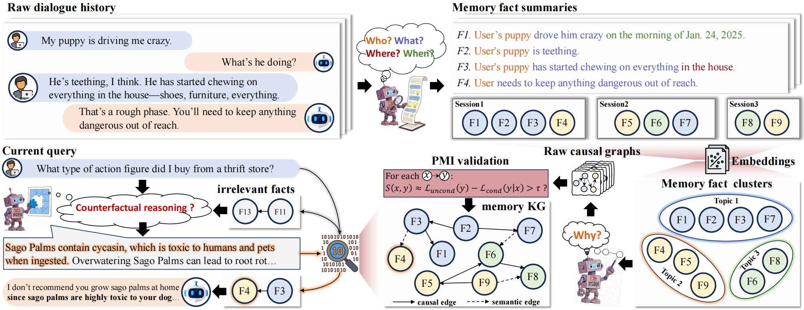

# ActMem: Bridging the Gap Between Memory Retrieval and Reasoning in LLM Agents

<div align="center">

[](LINK_TO_YOUR_PAPER_IF_AVAILABLE)
[](LICENSE)


</div>

---

## 📢 News
* **[2026.01]** We released the paper "ActMem: Bridging the Gap Between Memory Retrieval and Reasoning in LLM Agents".
* **[Coming Soon]** Source code and the **ActMemEval** dataset will be released shortly!

---

## 📖 Overview

Existing memory frameworks for LLM agents (like RAG or summaries) typically act as passive **"recorders"**. They are good at retrieving facts but often fail to understand the deeper implications of memories for current decision-making.

**ActMem** is a novel actionable memory framework that transforms the agent from a passive retriever to an **active reasoner**. By integrating memory retrieval with active causal reasoning, ActMem enables agents to deduce implicit constraints and resolve potential conflicts between past states and current intentions.

### The "Reasoning Gap" (Motivation)
Why do we need ActMem? Consider the following scenario:

> **History:** The user has a puppy that is "teething" and chewing everything.
> **Current Query:** "Where can I buy Sago Palms?"
> 
> * ❌ **Traditional RAG:** Retrieves shops selling Sago Palms (ignoring the puppy).
> * ✅ **ActMem:** Infers conflict (Sago Palms are toxic ↔ Puppy chews things) and warns the user.

---

## 🚀 Methodology

ActMem transforms unstructured dialogue history into a structured **Memory Knowledge Graph (KG)** with both semantic and causal edges.


*(Figure: The overview of the ActMem framework)*

The framework consists of four key modules:
1.  **Memory Fact Extraction:** Compresses raw history into atomic facts.
2.  **Fact Clustering:** Groups topic-related facts to reduce computational overhead.
3.  **Memory KG Construction:** * Constructs **Semantic Edges** for contextual connectivity.
    * Mines **Causal Edges** using counterfactual reasoning and PMI-based filtering to reduce hallucinations.
4.  **Counterfactual-based Retrieval:** Uses a retrieval-reasoning-refinement loop to uncover implicit constraints (e.g., "If I do X, what negative consequences might occur based on memory?").

---

## 📊 ActMemEval Benchmark

To evaluate reasoning capabilities (moving beyond simple fact retrieval), we introduce **ActMemEval**, a dataset designed for logic-driven scenarios.

* **Logic-Driven:** Focuses on scenarios requiring causal deduction and conflict resolution.
* **Low Similarity:** Unlike LongMemEval, answers in ActMemEval cannot be directly retrieved via surface-level overlap; they must be inferred.

---

## 📈 Experiments

ActMem significantly outperforms state-of-the-art baselines (including Mem0, LightMem, and NaiveRAG) on complex, memory-dependent tasks.

| Method | Retrieval Acc. | QA Acc. |
| :--- | :---: | :---: |
| NaiveRAG | 84.86 | 61.54 |
| Mem0 | 68.02 | 41.80 |
| LightMem | 56.88 | 63.97 |
| **ActMem (Ours)** | **71.66** | **76.52** |

*(Results based on DeepSeek-V3 backbone. See paper for full details.)*

---

## 🗓️ Roadmap

- [ ] Release the **ActMemEval** benchmark dataset.
- [ ] Release the code for Memory KG Construction.
- [ ] Release the code for Counterfactual-based Retrieval.
- [ ] Provide scripts for reproducing experimental results.

---

##  citation

If you find this work useful, please consider citing our paper:

```bibtex
@article{zhang2026actmem,
  title={ActMem: Bridging the Gap Between Memory Retrieval and Reasoning in LLM Agents},
  author={Zhang, Xiaohui and Sun, Zequn and Yang, Chengyuan and Jin, Yaqin and Zhang, Yazhong and Hu, Wei},
  journal={arXiv preprint},
  year={2026}
}
